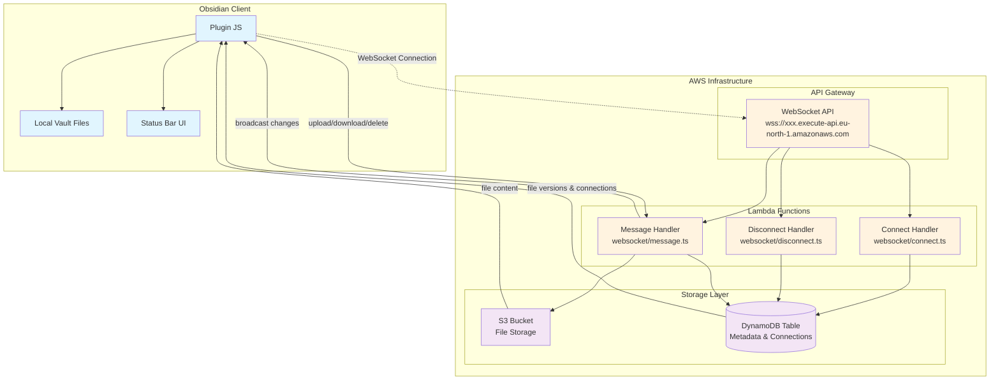

# 🚀 Obsync - Personal Obsidian Sync Engine

A **real-time, self-hosted sync solution** for Obsidian.md built on AWS infrastructure. This project provides a complete sync engine with WebSocket-based real-time synchronization, bulk operations, and smart conflict detection.

## ✨ Features

### 🔄 **Real-time Sync**
- **WebSocket-based** live synchronization 
- **Automatic file watching** with debouncing
- **Instant updates** across multiple clients
- **Connection resilience** with auto-reconnect

### 📦 **Bulk Operations**
- **Smart Sync** - Bidirectional sync (upload newer, download missing)
- **Upload All** - Sync all modified files to cloud
- **Download Vault** - Download entire vault from cloud
- **Sync Status Check** - Compare local vs cloud files

### 🎯 **User Experience**
- **Clickable status indicator** in Obsidian status bar
- **Progress tracking** during bulk operations  
- **Out-of-sync warnings** with ⚠️ visual indicators
- **Detailed sync reports** with file-by-file breakdown

### 🗑️ **File Management**
- **Delete synchronization** - Local deletes propagate to cloud
- **Soft delete with TTL** - 30-day recovery period
- **Version tracking** with timestamps

## 🏗️ Architecture



### 🔧 **Core Components**

#### **Frontend (Obsidian Plugin)**
- **WebSocket Client** - Maintains persistent connection
- **File Watcher** - Detects local file changes  
- **Sync Manager** - Handles bulk operations and queuing
- **UI Components** - Status bar, progress indicators, command palette

#### **Backend (AWS Lambda)**
- **Connect Handler** - Manages WebSocket connections in DynamoDB
- **Message Handler** - Processes upload/download/delete/list operations
- **Disconnect Handler** - Cleans up connection state

#### **Storage**
- **S3 Bucket** - Stores actual file content with versioning
- **DynamoDB** - Stores file metadata, versions, and active connections
- **TTL Support** - Automatic cleanup of deleted files after 30 days

## 🚀 Getting Started

### **Prerequisites**
- [Bun](https://bun.sh) runtime
- AWS Account with CLI configured
- [SST](https://sst.dev) for infrastructure

### **1. Clone & Install**
```bash
git clone <your-repo>
cd obsync
bun install
```

### **2. Deploy Infrastructure**
```bash
# Development deployment
bun sst dev

# Production deployment  
bun sst deploy --stage production
```

### **3. Build Plugin**
```bash
cd packages/plugin
bun run build
```

### **4. Install Plugin in Obsidian**
1. Copy `packages/plugin/main.js` and `packages/plugin/manifest.json` 
2. Place in `.obsidian/plugins/obsync/` in your vault
3. Enable plugin in Obsidian settings
4. Configure WebSocket URL from SST output

### **5. Configure & Connect**
1. Open plugin settings in Obsidian
2. Enter WebSocket URL: `wss://xxx.execute-api.region.amazonaws.com/$default`
3. Click the status bar indicator to connect
4. Start syncing! 🎉

## 📱 Usage

### **Quick Sync**
- **Click status bar** - Toggle sync on/off instantly
- **File watching** - Auto-sync when files change (2s debounce)
- **Status indicators** - 🟢 Connected, 🔴 Disconnected, 🔵 Syncing, 🟡 Error

### **Bulk Operations (Ctrl/Cmd+P)**
- `Sync: Smart sync (upload newer, download missing)` ⭐ **RECOMMENDED**
- `Sync: Upload all files to cloud` - One-way upload
- `Sync: Download entire vault from cloud` - One-way download  
- `Sync: Check which files are out of sync` - Detailed report

### **Individual Files**
- `Sync: Upload active file to cloud`
- `Sync: Download active file from cloud`
- `Sync: List files in cloud`

## 🔍 Monitoring & Debugging

### **Console Logs**
The plugin logs detailed information to browser console:
```javascript
// Open DevTools in Obsidian (Ctrl+Shift+I)
// Look for sync status, file operations, and error messages
```

### **SST Dashboard** 
```bash
# View logs and metrics
bun sst dev  # Keep this running for live logs
```

### **Status Reports**
Use "Check sync status" command for detailed file comparison:
- 📝 **Modified locally** - Files changed since last sync
- 📤 **Local only** - Files not yet uploaded
- 📥 **Cloud only** - Files not downloaded locally

## 🏗️ Development

### **Project Structure**
```
obsync/
├── packages/
│   ├── backend/          # AWS Lambda functions
│   │   └── src/websocket/
│   │       ├── connect.ts    # WebSocket connection handler
│   │       ├── disconnect.ts # WebSocket disconnection handler  
│   │       └── message.ts    # File operations handler
│   └── plugin/           # Obsidian plugin
│       ├── src/main.ts       # Plugin main logic
│       ├── manifest.json     # Plugin metadata
│       └── main.js          # Built plugin (generated)
├── sst.config.ts         # Infrastructure as code
└── README.md
```

### **Local Development**
```bash
# Start SST development
bun sst dev

# Build plugin (in another terminal)
cd packages/plugin
bun run dev  # Watch mode

# Test changes in Obsidian by reloading plugin
```

### **Key Files**
- **`sst.config.ts`** - Defines AWS infrastructure  
- **`packages/plugin/src/main.ts`** - Main plugin logic
- **`packages/backend/src/websocket/message.ts`** - Core sync logic

## 🔒 Security & Production

### **Current Status**
- ✅ **WebSocket Security** - AWS API Gateway handles SSL/TLS
- ✅ **Soft Deletes** - 30-day recovery period with TTL
- ⚠️ **Authentication** - Currently no auth (single user)
- ⚠️ **Access Control** - Files are accessible to anyone with URLs

### **Roadmap**
- [ ] Add authentication/authorization
- [ ] User isolation and access controls
- [ ] Encryption at rest and in transit
- [ ] Rate limiting and abuse prevention

## 📊 Metrics & Monitoring

### **Current Capabilities**
- **Connection tracking** in DynamoDB
- **File operation logs** in CloudWatch
- **Real-time status** in Obsidian UI
- **Detailed sync reports** with file-level breakdown

### **Performance**
- **Batched operations** - 3 files per batch, 500ms delays
- **Debounced file watching** - 2-second delays prevent spam
- **Connection resilience** - Exponential backoff (max 5 attempts, 30s delay)

## 🆘 Troubleshooting

### **Connection Issues**
- Check WebSocket URL in settings
- Verify AWS credentials and permissions
- Look for error messages in browser console

### **Sync Problems**  
- Use "Check sync status" for detailed diagnostics
- Check CloudWatch logs for Lambda errors
- Verify S3 bucket permissions

### **Plugin Issues**
- Reload plugin in Obsidian settings
- Check for JavaScript errors in DevTools
- Ensure `main.js` is built and up-to-date

## 🤝 Contributing

This is a personal project, but feedback and suggestions are welcome!

### **Built With**
- **Frontend**: TypeScript, Obsidian API
- **Backend**: AWS Lambda, TypeScript  
- **Infrastructure**: SST, AWS (API Gateway, S3, DynamoDB)
- **Tooling**: Bun, esbuild

---

<div align="center">

**⚡ Built with [SST](https://sst.dev) and [Bun](https://bun.sh) ⚡**

</div>
